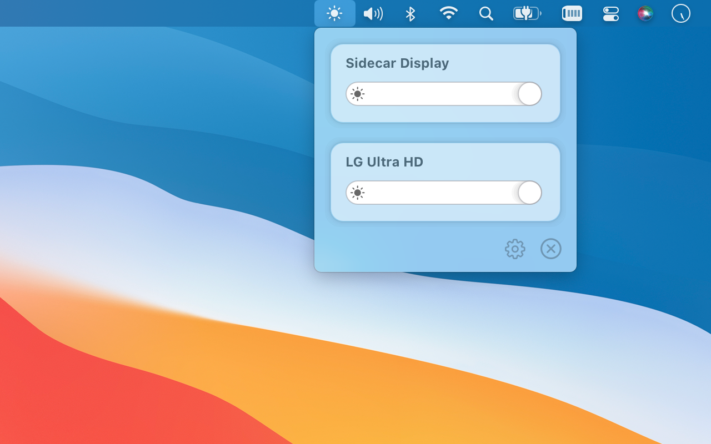
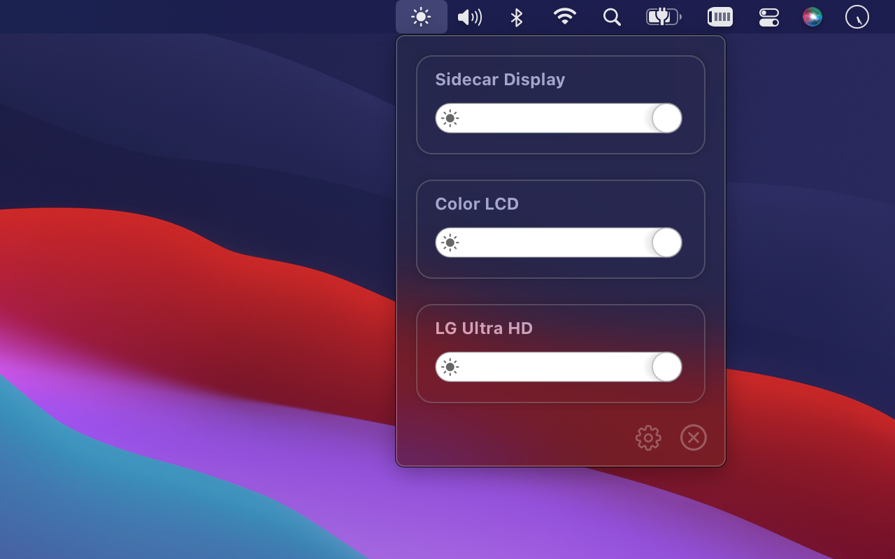
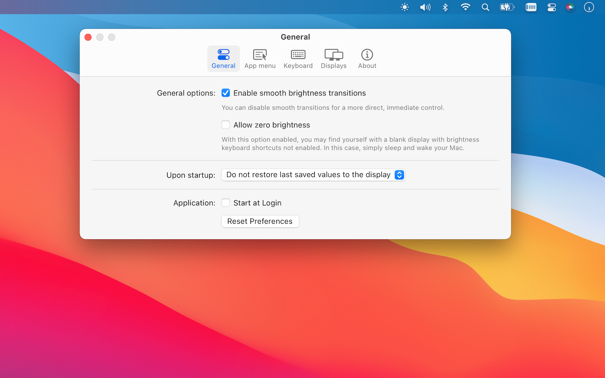
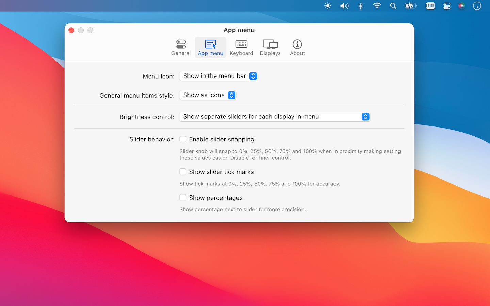
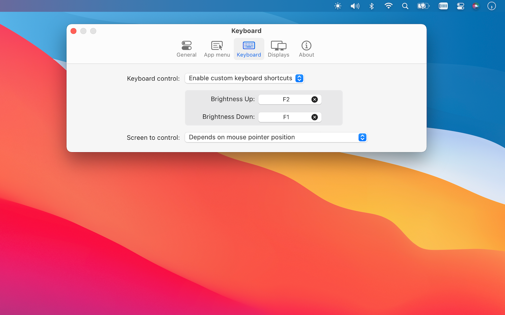
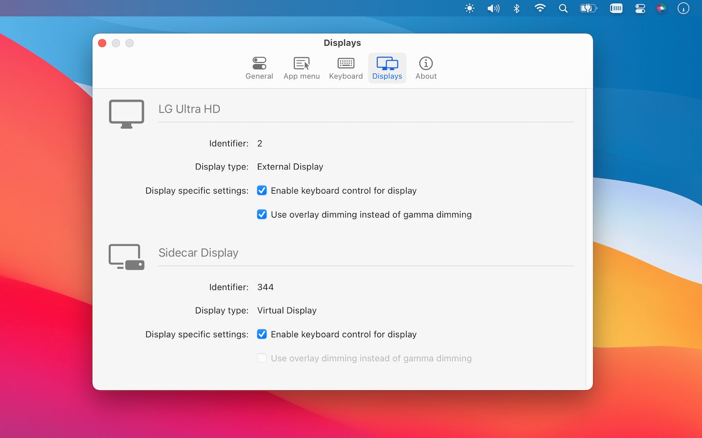

<h2>MonitorControl Lite</h2>
  
Control your display's brightness from the macOS menu bar.

  

  

 

## About

MonitorControl Lite is a simplified version of the popular Mac app [MonitorControl](https://github.com/MonitorControl/MonitorControl) providing an even more user friendly experience thanks to the increased convenience, security and user protection offered by the App Store.

## Download

The app will be available in the App Store. Stay tuned.

## Major features

- Control your display's brightness by software dimming.
- Supports multiple software based protocols to adjust brightness - advanced gammatable based control or overly dimming for AirPlay, Sidecar and DisplayLink devices.
- Supports smooth brightness transitions.
- Support for custom keyboard shortcuts.
- Several customization options.
- Modern, stylish customizable menulet reflecting the design of Control Control introduced in newer macOS versions.
- Simple, unobstrusive UI to blend into the general aesthetics of macOS (even the menu icon can be hidden).

## macOS compatibility

MonitorControl Lite is compatible with macOS 10.14 or newer.

## Supported displays

All displays are supported.

## Difference between MonitorControl and MonitorControl Lite

The following functionality is not present in MonitorControl Lite as compared with [MonitorControl](https://github.com/MonitorControl/MonitorControl) in order to simplify the experience and conform to the App Store guidelines for increased security and user protection:

- Hardware DDC and Apple display control (brightenss, audio, contrast)
- Native macOS OSD popup
- Usage of native Apple Keyboard media keys (custom shortcuts are supported)
- MonitorControl Lite is available in English only.

## Privacy Policy

MonitorControl Lite does not collect any personal information.

## Screenshots

## Maintainer

- [@waydabber](https://github.com/waydabber)

## Thanks

- To the [MonitorControl team](https://github.com/MonitorControl/MonitorControl#maintainers).
